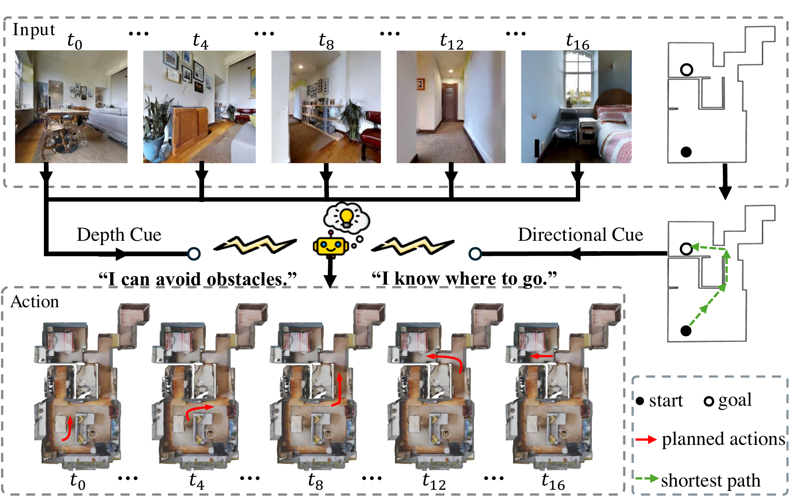

# GlocDiff

[](https://arxiv.org/abs/2511.01493)
[](./LICENSE)


Official implementation of ["Floor Plan-Guided Visual Navigation Incorporating Depth and Directional Cues"](https://arxiv.org/abs/2511.01493).

<sub>[Weiqi Huang](https://wikiahuang.github.io/) · [Jiaxin Li](https://gauleejx.github.io/) · [Zan Wang](https://silvester.wang/) · Huijun Di · [Wei Liang](https://liangwei-bit.github.io/web/) · Zhu Yang</sub>

<p align="center">
  
</p>

## Overview

GlocDiff predicts a robot's future trajectory with a diffusion policy conditioned on two parts:
- **Shortest path**: the shortest-path waypoints to the goal are fed directly into the 1D conditional U-Net as the local condition.
- **Depth + floor plan + pose + goal**: a short history of RGB observations is converted to depth latents with a pretrained [Marigold](https://huggingface.co/prs-eth/marigold-depth-lcm-v1-0) depth model and encoded by `depth_latent_processor` (MLP + Transformer encoder); this is fused with the scene's floor plan image, current position/heading, and goal position by `deep_floor_net` (EfficientNet-b0 + MLP fusion) into a single global condition embedding.

The U-Net (`ConditionalUnet1D`, from [diffusion_policy](https://github.com/real-stanford/diffusion_policy)) is trained with a DDPM noise scheduler to denoise future waypoints given these two conditions.

```
model/
  glocdiff.py               # top-level module wrapping the three submodules below
  depth_latent_processor.py # depth latents -> condition embedding
  deepfloor_net.py          # floor plan + pose + goal -> condition embedding
  rgb_processer.py          # RGB-only condition embedding (for ablation, currently unused)
utils/
  train.py                  # training entry point
  train_utils.py            # training loop, loss computation, visualization
  glocdiff_dataset.py        # dataset class
  data_utils.py              # coordinate/image transform helpers
  test_glocdiff.py           # closed-loop evaluation entry point (iGibson simulator)
  compute_nav_metrics.py     # SR / SPL / SoftSPL from saved test_glocdiff.py rollouts
```

## Training

### Pre-requisites
- Linux, NVIDIA GPU(s) with a CUDA 12.4-compatible driver
- conda (or miniconda)

### Setup
1. Create the conda environment (this same environment is also used for simulator testing below, hence the Python 3.8 pin -- iGibson's bundled native renderer only compiles against it):
   ```bash
   conda env create -f config/environment.yaml
   conda activate GlocDiff
   ```
2. `diffusion_policy` is not published on PyPI and must be cloned into the project root and installed in editable mode:
   ```bash
   cd GlocDiff
   git clone https://github.com/real-stanford/diffusion_policy.git
   pip install -e diffusion_policy/
   ```
   It must live at `GlocDiff/diffusion_policy/` for the import path in `utils/train.py` to resolve correctly.

### Data Preparation
1. Download the dataset from [ModelScope](https://modelscope.cn/datasets/weiqihuang/flona_with_shortestpath).

### Let's train GlocDiff!

1. Fill in `config/glocdiff.yaml`: at minimum set `datasets.data_folder`, `datasets.traversable_map_folder`, and `datasets.scene_names` to your own data. Set `logger` to `tensorboard`, `wandb`, or `none`, and `load_run` to `null` for a fresh run (or to a checkpoint directory / a standalone `.pth` weights file to resume/warm-start from).

2. Launch training with `torchrun` (or `python -m torch.distributed.run` if `torchrun`'s own shebang doesn't match your conda environment's Python):
   ```bash
   cd utils
   torchrun --nproc_per_node=<num_gpus> --master_port=29500 train.py --config ../config/glocdiff.yaml
   ```

Checkpoints are saved every epoch under `utils/logs/<project_name>/<run_name>/`.

## Test in Simulator

You can use a model you trained yourself, or the checkpoint we provide at [`glocdiff_checkpoint.pth`](./glocdiff_checkpoint.pth). Testing runs a closed-loop rollout in [iGibson](https://github.com/StanfordVL/iGibson): the model replans a short path every few steps, and the iGibson camera (standing in for the robot) walks through it until it reaches the goal, gets stuck, or hits the step limit.

### Setup

In the same `GlocDiff` conda environment, clone iGibson into the project root and install it in editable mode:
```bash
conda activate GlocDiff
cd GlocDiff
git clone https://github.com/StanfordVL/iGibson.git --recursive
pip install -e iGibson/
```

You'll also need (none of this is stored in this repo):
- iGibson's [scene + shared assets](https://github.com/StanfordVL/iGibson/blob/master/docs/installation.md), under `iGibson/igibson/data/`
- Test trajectories + floor plans, same layout as training, under the scene's `test` split
- Per-scene traversable maps (`foucused_map.png`, `map.png`, `floor_trav_test_<floor>_modified_8bit.png`)

### Running a test

1. Fill in `config/test_glocdiff.yaml`: `checkpoint_path`, `testdataset`, `trav_maps_path`, `scene_path`, `test_scenes`, and `traj_index_range`.

2. Run it:
   ```bash
   cd utils
   python test_glocdiff.py --config ../config/test_glocdiff.yaml
   ```

Each run writes to its own timestamped folder under `state_save_dir`:
```
<state_save_dir>/run_<timestamp>/
  test_glocdiff.log              # full log (console only shows nav-relevant lines)
  <scene>/<traj_name>/
    frames/                      # every rendered RGB frame
    trajectory.png               # path overlaid on the scene's floor plan
    states.txt                   # [x, y, heading_x, heading_y, collision] per frame
```

3. Compute success rate / SPL / SoftSPL from a run's saved trajectories:
   ```bash
   python compute_nav_metrics.py --config ../config/test_glocdiff.yaml
   ```
   This defaults to the most recent run under `state_save_dir`; pass `--state-save-dir` to point at a specific one, or `--arrive-th`/`--collision-limit` to sweep thresholds.

## Citation

```bibtex
@article{huang2025floor,
  title={Floor Plan-Guided Visual Navigation Incorporating Depth and Directional Cues},
  author={Huang, Weiqi and Li, Jiaxin and Wang, Zan and Di, Huijun and Liang, Wei and Yang, Zhu},
  journal={arXiv preprint arXiv:2511.01493},
  year={2025}
}
```

## Acknowledgments

This codebase builds on [diffusion_policy](https://github.com/real-stanford/diffusion_policy) for the conditional U-Net, [Marigold](https://huggingface.co/prs-eth/marigold-depth-lcm-v1-0) for monocular depth estimation, and [iGibson](https://github.com/StanfordVL/iGibson) for simulation. Thanks to the authors for open-sourcing their work.

## License

This project is released under the [MIT License](./LICENSE).
